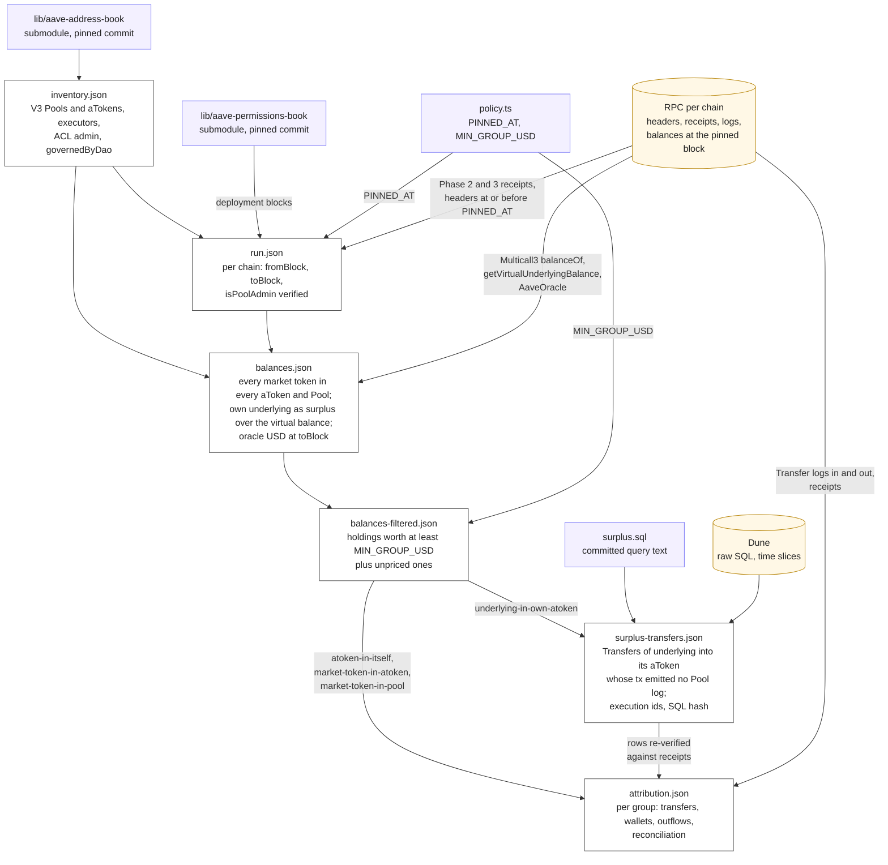
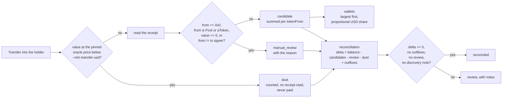

# Aave Rescue Mission (WIP)

Maintained by TokenLogic since September 2026. Phases 1 to 3 were delivered by BGD Labs (MIT, attribution retained in `LICENSE`).

Phase 4 recovers tokens sent by mistake to Aave V3 Pools and aTokens on all production chains since the last rescue. V3 exposes `rescueTokens` on Pools and aTokens, so no implementation upgrade is needed for three of the four cases, and the V1/V2 upgrade code, its tests and the Governance V2 tooling were removed from `main`. The Phase 2 & 3 implementation as executed in 2023 is preserved at the tag `phase-2-3-final`. The Merkle tooling, the claim data under `js-scripts/maps/` and the `AaveMerkleDistributor` contract (`rescue-mission-phase-1` submodule) are reused.

## Phase 4 scripts

```
yarn phase4:inventory                    # js-scripts/phase4/data/inventory.json from the pinned address book
yarn phase4:ranges [--refresh]              # js-scripts/phase4/data/run.json at PINNED_AT (policy.ts), needs ALCHEMY_API_KEY or RPC_* in .env
yarn phase4:balances                     # js-scripts/phase4/data/balances.json, stuck balances at each chain's toBlock
yarn phase4:filter                       # js-scripts/phase4/data/balances-filtered.json, holdings worth at least MIN_GROUP_USD (policy.ts)
yarn phase4:surplus [--refresh]             # js-scripts/phase4/data/surplus-transfers.json, Dune query for underlying in its own aToken, needs DUNE_API_KEY; completed holdings reused unless --refresh
yarn phase4:attribution [--min-transfer-usd 1]   # js-scripts/phase4/data/attribution.json, who sent what, all four kinds
yarn test                                # vitest: determinism and invariants
```

### How the numbers are produced

Each step writes one canonical JSON file (sorted keys) and records the `sha256` of every file it read, as written. A step refuses to run when its inputs do not chain back to the pinned sources. Dune proposes rows; the transaction receipt is what proves them.



Inside `attribution.json`, each holding becomes one group and each inbound transfer is classified before anything is summed:



### The files

`inventory.json` comes from the [aave-address-book](https://github.com/aave-dao/aave-address-book) Foundry submodule in `lib/`, pinned by commit and read through the TypeScript constants it ships next to the Solidity libraries, so contracts and scripts see one release. It lists every V3 Pool and aToken on the 21 production chains that have a Governance V3 executor: symbol, decimals, the chain's executor, the market's ACL admin and manager, and the address-book module each row came from. A `governedByDao` flag is true when the ACL admin is the executor. Whitelabel or otherwise permissioned instances have it false and appear under `exclusions`. The file is committed and regenerated only when the address-book pin moves.

`run.json` pins the block window per chain. Scanning starts at the Phase 2 & 3 execution block on Ethereum, Polygon, Optimism and Avalanche, verified from the receipt, and elsewhere at the market's deployment block as recorded by the DAO-maintained [aave-permissions-book](https://github.com/aave-dao/aave-permissions-book) (`lib/aave-permissions-book`, pinned commit). It ends at the last block at or before `PINNED_AT` from `policy.ts`, which must already be in the past on every chain. The script reads block headers, receipts and one `isPoolAdmin` view call per market, so no archive node is needed. The RPC per chain is `RPC_<ALIAS>` when set, otherwise it is built from `ALCHEMY_API_KEY`. Every range is verified before it is written, whether fresh or reused from a previous `run.json` with the same `PINNED_AT`: the RPC's chain id, the end block against headers, the start block against its evidence, and for each DAO-governed market that the executor holds `POOL_ADMIN` on the ACL manager, which is the gate on `rescueTokens`. `--refresh` recomputes everything. A chain with no RPC, or one that fails verification, is recorded under `failures` rather than skipped, and `run.json` counts as final only when that list is empty.

`balances.json` is the discovery step, read at each chain's pinned `toBlock` for DAO-governed markets only. For every market token (each reserve's underlying and its aToken) held by every aToken and by the Pool, batched through Multicall3, the script records what it finds. An aToken legitimately holds only its own underlying, and only up to `Pool.getVirtualUnderlyingBalance`, so for that pair the surplus over the virtual balance is reported, with a note when the virtual balance is zero or the surplus is negative. Anything else found in an aToken or a Pool is stuck. Amounts are base-unit integers with a formatted copy. Each holding also carries the market oracle's USD price at the same block and the resulting value when the oracle has one. Zero balances are omitted. The manifest records the hashes of the `run.json` and `inventory.json` it was built from.

`balances-filtered.json` keeps the holdings worth at least `MIN_GROUP_USD` from `policy.ts`, plus any holding the oracle could not price. A group below the threshold cannot contain an eligible wallet, so later steps read only this file.

`surplus-transfers.json` covers the one kind the RPC cannot scan. Underlying flows into its own aToken on every supply and repay, millions of transfers, so `phase4:surplus` runs `surplus.sql` on Dune as raw SQL: transfers of the underlying into the aToken whose transaction emitted no Pool log, read in one pass per time slice. The SQL is committed here and its hash travels with the results, together with every execution id.

`attribution.json` answers who sent the tokens, in one format for all four kinds. Three kinds have no legitimate inbound flow, so every `Transfer` into the holder over the pinned window is a candidate and comes from RPC logs (`evidence.source: rpc-logs`): aTokens held by themselves, other market tokens in an aToken, anything in a Pool. For the fourth kind attribution takes the Dune rows and re-verifies each one against the transaction receipt (`evidence.source: dune-anti-join`). Any contradiction fails that chain. Without `surplus-transfers.json` those holdings are recorded as `deferred`; a surplus file with failures, or one that is missing a holding, fails the chain too.

Transfers worth less than `--min-transfer-usd` (default 1) at the holding's oracle price are recorded as `dust`. They stay in the totals but no receipt is read for them and they are not aggregated into wallets, which keeps address-poisoning noise off the RPC. Every other transfer keeps the ERC-20 `from`, which is the beneficiary, and the transaction signer separately. Mints, transfers from the market's own contracts, zero-value transfers and transfers whose sender is not the signer (a router, a Safe, a relayer) go to `manual_review`. Transfers are listed candidates first, then review, then dust, largest first within each. Candidates are summed per wallet with a proportional USD share as an annotation, and outflows from the holder are listed for the RPC kinds. A group is `reconciled` only when no transfer needs review, nothing left the holder in the window, the totals match the balance (for the surplus kind, the surplus over the virtual balance) and discovery raised no note. Otherwise it is `review`, with the likely cause noted.

Both `phase4:surplus` and `phase4:attribution` refuse inputs that do not form one final chain built under the current `policy.ts`: the filtered file must be exactly what `phase4:filter` produces from `balances.json`, `balances.json` must hash to `run.json` and `inventory.json`, `run.json` must be pinned at `PINNED_AT`, and none of them may carry failures. Attribution also ties `surplus-transfers.json` to the filtered file and to the committed `surplus.sql`.

## TODO

- Merkle: port `parse-balance-map.ts`, `generate-merkle-root.ts`, `users-resume.ts` and `format.ts` from ethers v5 to viem behind a byte-for-byte equivalence test against the Phase 2 & 3 trees, then build the trees and claim JSON from a signed-off `mission.json` (eligibility policy applied to `attribution.json`).
- Contract change: `AToken.rescueTokens` rejects the underlying, so the `underlying-in-own-atoken` groups need an upstream change in `aave-v3-origin` allowing the surplus over `getVirtualUnderlyingBalance`, or a one-off implementation upgrade.
- Proposals: deploy `AaveMerkleDistributor` on chains without one (`make deploy-distributor`), then one payload per chain in `aave-proposals-v3` calling `addDistributions` and `rescueTokens`, with claim tests on a fork.
- Claim UI and forum post.

The Phase 2 & 3 documentation follows.

---

# Aave Rescue Mission Phase 2 & 3 🚑 👻


Repository containing all the code needed for Phase 2 & 3 to rescue tokens sent directly to contracts of the Aave ecosystem.

This phase will affect the tokens locked on smart contracts of the Aave liquidity pools: Aave v1 Ethereum, Aave v2 Ethereum, Aave v2 AMM, Aave v3 (all networks).

<br>

The following table represents the tokens to rescue from various contracts:

| Tokens to Rescue                                                                             | Contract where tokens are stuck                                                                    | Amount                  | Network   |
| -------------------------------------------------------------------------------------------- | -------------------------------------------------------------------------------------------------- | ----------------------- | --------- |
| [AAVE V2 A_RAI](https://etherscan.io/address/0xc9BC48c72154ef3e5425641a3c747242112a46AF)     | [AAVE V2 A_RAI](https://etherscan.io/address/0xc9BC48c72154ef3e5425641a3c747242112a46AF)           | 1481.16074087007480402  | ETHEREUM  |
| [AAVE V1 A_WBTC](https://etherscan.io/address/0xFC4B8ED459e00e5400be803A9BB3954234FD50e3)    | [AAVE V1 POOL](https://etherscan.io/address/0x398eC7346DcD622eDc5ae82352F02bE94C62d119)            | 1.92454215              | ETHEREUM  |
| [USDT](https://etherscan.io/address/0xdac17f958d2ee523a2206206994597c13d831ec7)              | [AAVE V2 AMM_POOL](https://etherscan.io/address/0x7937D4799803FbBe595ed57278Bc4cA21f3bFfCB)        | 20600.057405            | ETHEREUM  |
| [DAI](https://etherscan.io/address/0x6b175474e89094c44da98b954eedeac495271d0f)               | [AAVE V2 POOL](https://etherscan.io/address/0x7d2768dE32b0b80b7a3454c06BdAc94A69DDc7A9)            | 22000                   | ETHEREUM  |
| [GUSD](https://etherscan.io/address/0x056fd409e1d7a124bd7017459dfea2f387b6d5cd)              | [AAVE V2 POOL](https://etherscan.io/address/0x7d2768dE32b0b80b7a3454c06BdAc94A69DDc7A9)            | 19994.86                | ETHEREUM  |
| [LINK](https://etherscan.io/address/0x514910771af9ca656af840dff83e8264ecf986ca)              | [AAVE V1 POOL](https://etherscan.io/address/0x398eC7346DcD622eDc5ae82352F02bE94C62d119)            | 4084                    | ETHEREUM  |
| [USDT](https://etherscan.io/address/0xdac17f958d2ee523a2206206994597c13d831ec7)              | [AAVE V2 A_USDT](https://etherscan.io/address/0x3Ed3B47Dd13EC9a98b44e6204A523E766B225811)          | 11010                   | ETHEREUM  |
| [USDC](https://etherscan.io/address/0xa0b86991c6218b36c1d19d4a2e9eb0ce3606eb48)              | [AAVE V2 POOL](https://etherscan.io/address/0x7d2768dE32b0b80b7a3454c06BdAc94A69DDc7A9)            | 1089.889717             | ETHEREUM  |
| [WBTC](https://polygonscan.com/address/0x1bfd67037b42cf73acf2047067bd4f2c47d9bfd6)           | [AAVE V2 POOL](https://polygonscan.com/address/0x8dFf5E27EA6b7AC08EbFdf9eB090F32ee9a30fcf)         | 0.22994977              | POLYGON   |
| [AAVE V2 A_DAI](https://polygonscan.com/address/0x27F8D03b3a2196956ED754baDc28D73be8830A6e)  | [AAVE V2 A_DAI](https://polygonscan.com/address/0x27F8D03b3a2196956ED754baDc28D73be8830A6e)        | 4250.580268097645600939 | POLYGON   |
| [AAVE V2 A_USDC](https://polygonscan.com/address/0x1a13F4Ca1d028320A707D99520AbFefca3998b7F) | [AAVE V2 A_USDC](https://polygonscan.com/address/0x1a13F4Ca1d028320A707D99520AbFefca3998b7F)       | 514131.378018           | POLYGON   |
| [USDC](https://polygonscan.com/address/0x2791bca1f2de4661ed88a30c99a7a9449aa84174)           | [AAVE V2 POOL](https://polygonscan.com/address/0x8dFf5E27EA6b7AC08EbFdf9eB090F32ee9a30fcf)         | 4515.242949             | POLYGON   |
| [USDT.e](https://snowtrace.io/address/0xc7198437980c041c805a1edcba50c1ce5db95118)            | [AAVE V2 POOL](https://snowtrace.io/address/0x4F01AeD16D97E3aB5ab2B501154DC9bb0F1A5A2C)            | 1772.206585             | AVALANCHE |
| [USDC.e](https://snowtrace.io/address/0xa7d7079b0fead91f3e65f86e8915cb59c1a4c664)            | [AAVE V2 POOL](https://snowtrace.io/address/0x4F01AeD16D97E3aB5ab2B501154DC9bb0F1A5A2C)            | 2522.408895             | AVALANCHE |
| [USDC.e](https://snowtrace.io/address/0xa7d7079b0fead91f3e65f86e8915cb59c1a4c664)            | [WETH_GATEWAY](https://snowtrace.io/address/0x8a47F74d1eE0e2edEB4F3A7e64EF3bD8e11D27C8)            | 14100                   | AVALANCHE |
| [USDC](https://optimistic.etherscan.io/address/0x7f5c764cbc14f9669b88837ca1490cca17c31607)   | [AAVE V3 POOL](https://optimistic.etherscan.io/address/0x794a61358D6845594F94dc1DB02A252b5b4814aD) | 44428.421035            | OPTIMISM  |

<br>

## Contents

This repository is a follow-up of [rescue mission phase 1](https://github.com/bgd-labs/rescue-mission-phase-1) and is divided into three parts:

- Scripts to fetch tokens to rescue off-chain using Dune analytics, generating address/value maps and Merkle trees for each token.
- Upgraded implementation contracts of Aave where funds are stuck, adding a rescue function.
- Proposal payloads.


<br>

## Setup:

To setup the project locally you will need to do:

`npm install`: You need to install all NodeJs dependencies in order to generate merkle trees.

`forge install`: The project uses [Foundry](https://github.com/foundry-rs/foundry) - so you will need to have it installed, and then install all its dependency.

Make sure to have the following in your `.env` file

```
# Tenderly forks
TENDERLY_FORK_URL_MAINNET= // to test all the claims on ethereum
TENDERLY_FORK_URL_POLYGON= // to test all the claims on polygon
TENDERLY_FORK_URL_AVALANCHE= // to test all the claims on avalanche
TENDERLY_FORK_URL_OPTIMISM= // to test all the claims on optimism

# Dune Api Key
DUNE_API_KEY= // to query data needed for rescue from dune

```

<br>

## Scripts

- `generate-address-value-map`: This script will query all token transfer events to Aave contracts using the [dune](https://dune.com/) API. For checking transactions where users have sent underlying token to the aToken contract itself, we filter out the transfer transactions - by removing those happening during "normal" operations such as Deposit, Repay, Liquidation, and Flashloan on the pool contract.

  For checking transactions where users have sent tokens to Aave v1 pool core, we also filter out the transfer transactions caused by Deposit, Repay, Liquidation, and Flashloan operations.

  This script also generates a [summary](https://github.com/bgd-labs/rescue-mission-phase-2-3/blob/main/js-scripts/maps/amountsByContract.txt) indicating the amount to rescue for every token sent on the contracts. Tokens with a value less than $1000 are ignored.

  ```
  npm run generate-json-mainnet
  npm run generate-json-l2
  ```

  This will generate the json for each token as: address - amounts - transactions.

  Example of a generated file from this command - [usdtRescueMap.json](https://github.com/bgd-labs/rescue-mission-phase-2-3/blob/main/js-scripts/maps/ethereum/usdtRescueMap.json)

- `generate-merkle-roots`: This script will take the above-generated address/value map JSON as input and generate a Merkle tree for each token on each network.

  ```
  npm run generate-tree
  ```

  Example of a generated file from this command: [usdtRescueMerkleTree.json](https://github.com/bgd-labs/rescue-mission-phase-2-3/blob/main/js-scripts/maps/ethereum/merkleTree/usdtRescueMerkleTree.json)

- `generate-json-formatted`: To format the address value map generated we can run the following command to format the json map in the token decimals.

  ```
  npm run generate-json-formatted
  ```

  Example of a generated file from this command: [usdtRescueMapFormatted.json](https://github.com/bgd-labs/rescue-mission-phase-2-3/blob/main/js-scripts/maps/ethereum/formatted/usdtRescueMapFormatted.json)

- `generate:users-json`: Script to generate user resume - which will include the proofs for the users in order to claim the tokens from the distributor contract. There will be one file generated for each network containing all the user summary.
  ```
  npm run generate:users-json
  ```
  Example of a generated file from this command: [usersMerkleTrees.json](https://github.com/bgd-labs/rescue-mission-phase-2-3/blob/main/js-scripts/maps/ethereum/usersMerkleTrees.json)

<br>

## Contracts

The following Aave contracts are updated by adding a rescue function that can transfer the stuck funds to the Merkle distributor contract.

- Aave v1 pool
- Aave v2 amm pool
- Aave v2 ethereum pool
- Aave v2 polygon pool
- Aave v2 avalanche pool
- Aave v2 aRai contract on ethereum
- Aave v2 aUsdt contract on ethereum
- Aave v2 aDai contract on polygon
- Aave v2 aUsdc contract on polygon

This is different than the previous approach in phase 1, where we were rescuing funds on the initialize method. Now we have a separate method `rescueTokens()` to rescue funds.

We have a Merkle distributor on each network which will distribute the tokens to the users.

On Ethereum, we will use the same Merkle distributor as in phase one while deploying new Merkle distributors on the other networks.

Implementation addresses of contracts before and after the rescue mission phase 2, 3:

| Previous Contract Impl                                                                                      | Upgraded Contract Impl                                                                              |
| ----------------------------------------------------------------------------------------------------------- | --------------------------------------------------------------------------------------------------- |
| [Aave v1 pool](https://etherscan.io/address/0xC1eC30dfD855c287084Bf6e14ae2FDD0246Baf0d)                     | [Aave v1 pool](https://etherscan.io/address/0xcb8c3dbf2530d6b07b50d0bce91f7a04fa696486)             |
| [Aave v2 amm pool](https://etherscan.io/address/0xaaca8859efd9643b98c042691da60b217c9cdd64)                 | [Aave v2 amm pool](https://etherscan.io/address/0xb9184a4480830bf89b55b73631e287df9079f466)         |
| [Aave v2 ethereum pool](https://etherscan.io/address/0xc6845a5c768bf8d7681249f8927877efda425baf)            | [Aave v2 ethereum pool](https://etherscan.io/address/0x085e34722e04567df9e6d2c32e82fd74f3342e79)    |
| [Aave v2 aRai ethereum](https://etherscan.io/address/0xb97fa7a950b19c8fe7d9bcd06909d3e67f20f16a)            | [Aave v2 aRai ethereum](https://etherscan.io/address/0x2cde0f77cf5d54e9417480a8611aa2fecd56bbd9)    |
| [Aave v2 aUsdt ethereum](https://etherscan.io/address/0x3f06560cfb7af6e6b5102c358f679de5150b3b4c)           | [Aave v2 aUsdt ethereum](https://etherscan.io/address/0x9651f64bd77550691eb2aeeb58188cb67f005902)   |
| [Aave v2 polygon pool](https://polygonscan.com/address/0x8dFf5E27EA6b7AC08EbFdf9eB090F32ee9a30fcf)          | [Aave v2 polygon pool](https://polygonscan.com/address/0x1685D81212580DD4cDA287616C2f6F4794927e18)  |
| [Aave v2 aDai polygon](https://polygonscan.com/address/0x80f2c02224a2e548fc67c0bf705ebfa825dd5439)          | [Aave v2 aDai polygon](https://polygonscan.com/address/0x6264E51782D739caf515a1Bd4F9ae6881B58621b)  |
| [Aave v2 aUsdc polygon](https://polygonscan.com/address/0x80f2c02224a2e548fc67c0bf705ebfa825dd5439)         | [Aave v2 aUsdc polygon](https://polygonscan.com/address/0x6264E51782D739caf515a1Bd4F9ae6881B58621b) |
| [Aave v2 avalanche pool](https://snowtrace.io/address/0x01ae7dda024ea9712344d9332c94d3168a91f342)           | [Aave v2 avalanche pool](https://snowtrace.io/address/0x102Bf2C03c1901AdBA191457A8c4A4eF18b40029)   |
| [Aave v3 Pool optimism](https://optimistic.etherscan.io/address/0x764594f8e9757ede877b75716f8077162b251460) | -                                                                                                   |

<br>

## Payloads:

- [Ethereum Payload](https://github.com/bgd-labs/rescue-mission-phase-2-3/blob/main/src/contracts/EthRescueMissionPayload.sol):
  - Updates v1 pool with rescue function
  - Updates v2 pool with rescue function
  - Updates v2 amm pool with rescue function
  - Updates v2 aRai contract with rescue function
  - Updates v2 aUsdt contract with rescue function
  - Registers MerkleRoot for each token on the Merkle distributor contract.
  - Transfers aRai, aBtc, Usdt, Usdc, Dai, Gusd, Link tokens to the Merkle distributor from the aave contracts where funds were stuck
- [Polygon Payload](https://github.com/bgd-labs/rescue-mission-phase-2-3/blob/main/src/contracts/PolRescueMissionPayload.sol):
  - Updates v2 pool with rescue function
  - Updates v2 aDai contract with rescue function
  - Updates v2 aUdsc contract with rescue function
  - Registers MerkleRoot for each token on the Merkle distributor contract.
  - Transfers Wbtc, aDai, aUsdc, Usdc tokens to the Merkle distributor contract.
- [Optimism Payload](https://github.com/bgd-labs/rescue-mission-phase-2-3/blob/main/src/contracts/OptRescueMissionPayload.sol)
  - Registers MerkleRoot for token on the Merkle distributor contract.
  - Transfers Usdc token to the Merkle distributor contract.
- [Avalanche Payload](https://github.com/bgd-labs/rescue-mission-phase-2-3/blob/main/src/contracts/AvaRescueMissionPayload.sol):
  - This payload should be called by the owner of addresses provider / pool admin / guardian.
  - Updates v2 pool with rescue function
  - Registers MerkleRoot for each token on the merkle distributor contract.
  - Transfers Usdc.e Usdt.e from the v2 to the merkle distributor contract.
  - Transfers Usdc.e from the wethGateway contract to the merkle distributor contract.

<br>

## Tests:

To run the tests:

```
forge test
```

To test all the claims on tenderly for all the users:

```
npm run test-eth-claims
npm run test-pol-claims
npm run test-ava-claims
npm run test-opt-claims
```

<br>

## License

Copyright © 2023, [BGD Labs](https://bgdlabs.com/). Released under the [MIT License](notion://www.notion.so/LICENSE).
